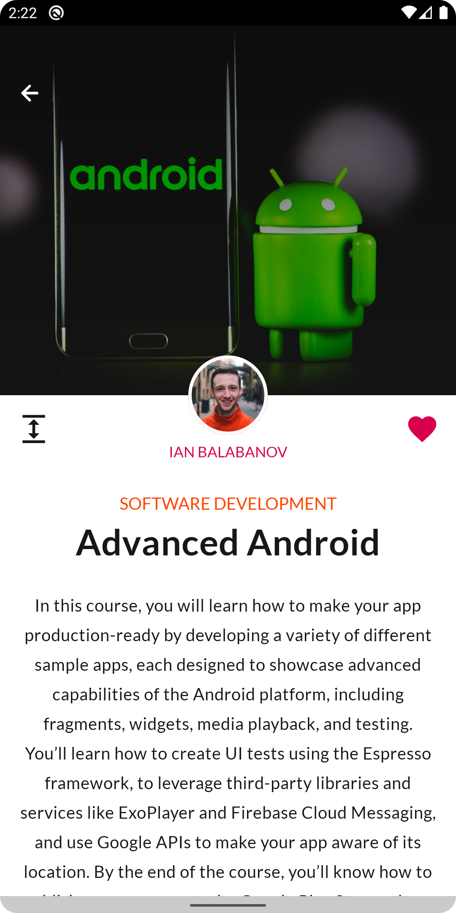
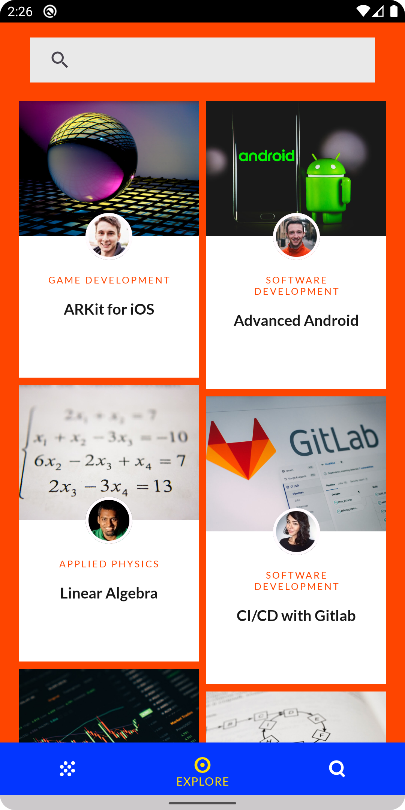
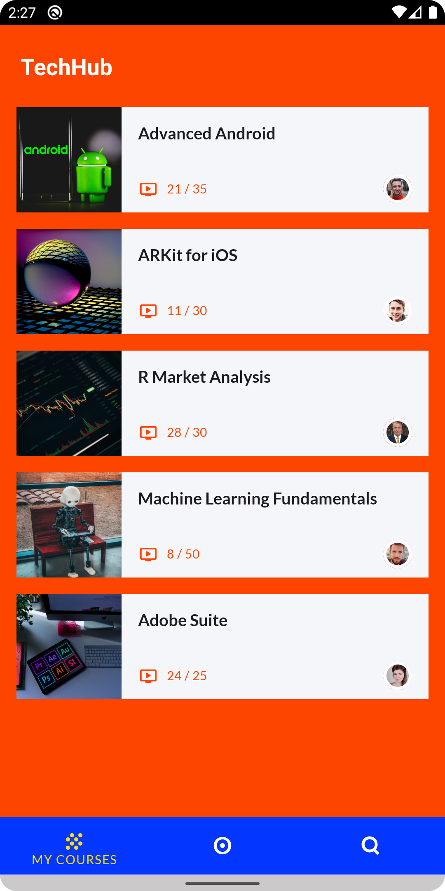
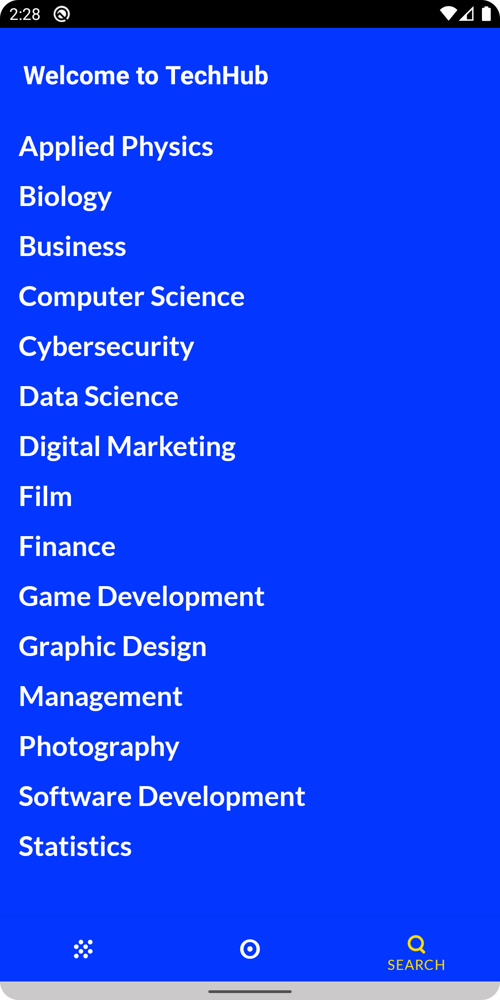
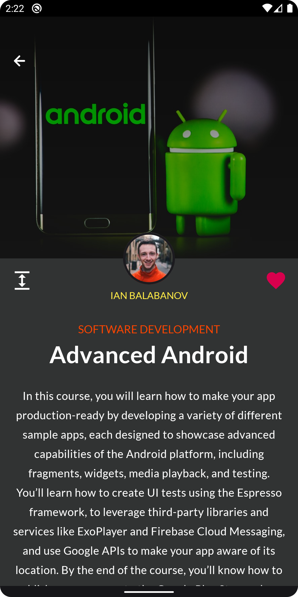
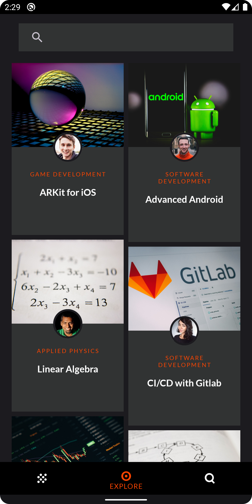
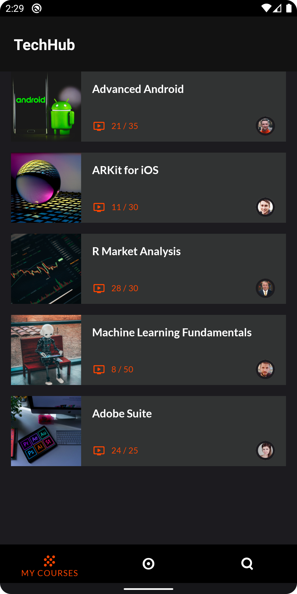
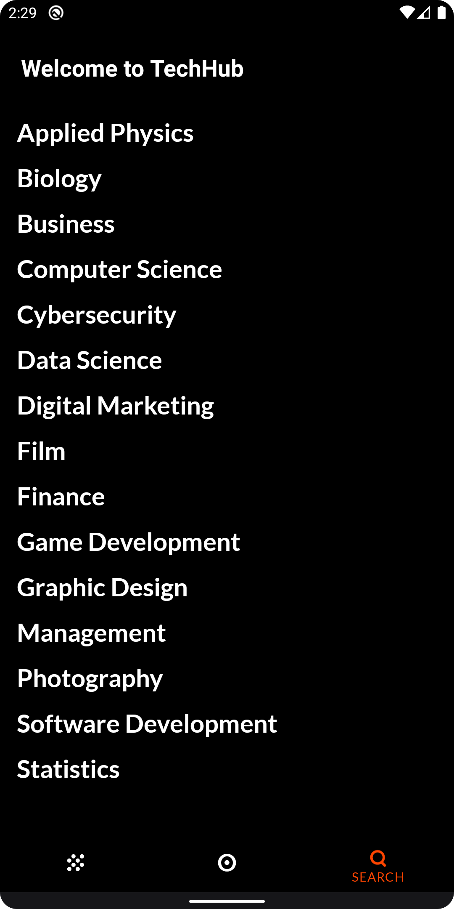

# TechHub

TechHub is a sample educational app that provides courses for people who want to learn new skills in mostly tech-related areas.

The goal of this project is to practice & demonstrate the use of some Modern Android Development Practices,
Material Design Theming & Android Animations.

## 🕹 Animations 🕹

This app uses shared element container transforms to create a visible connection between two UI elements and represent
parent-child relationships between fragment transitions.

List Item	|	Card Item	|	Swipe to Delete | Bouncing Text	|
:------:|:---------------------:|:-----------------------------:|:-------------:|
  |    |    |  


## 🛠 Architecture 🛠

The application complies with the following recommended best practices for building robust, high-quality apps.

* **Single Activity Architecture**: One single activity and several fragments.
* **MVVM**: MVVM based architecture, using a local database as a Single Source of Truth.
* **SOLID**: Software design principles intended to make object-oriented software more understandable, flexible and maintainable.
* **Android Architecture Components**:  libraries part of Android Jetpack to give a robust design, testable and maintainable to modern applications.


## 🦾 Tech Stack 🦾

This project takes advantage of many popular libraries and tools in the Android ecosystem:

* **ROOM**: Persistence Library that provides an abstraction layer over SQLLite to allow for a more robust database access.
* **Lifecycle**: Perform actions in response to a change in the lifecycle status of another component.
* **ViewModel**: Designed to manage and store UI related data in a lifecycle conscious way.
* **LiveData**: A lifecycle-aware observable data holder class, that respects the lifecycle of other app components.
* **Navigation**: Implement navigation and transactions between fragments.
* **Kotlin Coroutines**: Managing background threads with simplified code and reducing needs for callbacks.
* **Kotlin Flow**: Cold asynchronous data stream that sequentially emits values
* **Kotlin Serialization**: Converts data used by an application to a format that can be transferred over a network or stored in a database or a file.
* **Dagger Hilt**: A fully static, compile-time dependency injection framework for both Java and Android.
* **Retrofit**: A type-safe HTTP client.
* **Glide**: An image loading library.
* **ViewBinding**: Allows you to more easily write code that interacts with views.
* **Material 3**: The latest version of Material Design, introduced in Android 12.
* **Material Motion**: A set of transition patterns that can help users understand and navigate an app.

## 📷 Screenshots 📷

| Details | Home |  Favorites | Topics
|:-:|:-:|:-:|:-:|
|  |  |  | 
| Details Dark | Home Dark |  Favorites Dark | Topics Dark
|  |  |  | 


## License
```
MIT License

Copyright (c) 2022 Jonathan Areas

Permission is hereby granted, free of charge, to any person obtaining a copy
of this software and associated documentation files (the "Software"), to deal
in the Software without restriction, including without limitation the rights
to use, copy, modify, merge, publish, distribute, sublicense, and/or sell
copies of the Software, and to permit persons to whom the Software is
furnished to do so, subject to the following conditions:

The above copyright notice and this permission notice shall be included in all
copies or substantial portions of the Software.

THE SOFTWARE IS PROVIDED "AS IS", WITHOUT WARRANTY OF ANY KIND, EXPRESS OR
IMPLIED, INCLUDING BUT NOT LIMITED TO THE WARRANTIES OF MERCHANTABILITY,
FITNESS FOR A PARTICULAR PURPOSE AND NONINFRINGEMENT. IN NO EVENT SHALL THE
AUTHORS OR COPYRIGHT HOLDERS BE LIABLE FOR ANY CLAIM, DAMAGES OR OTHER
LIABILITY, WHETHER IN AN ACTION OF CONTRACT, TORT OR OTHERWISE, ARISING FROM,
OUT OF OR IN CONNECTION WITH THE SOFTWARE OR THE USE OR OTHER DEALINGS IN THE
SOFTWARE.
```
